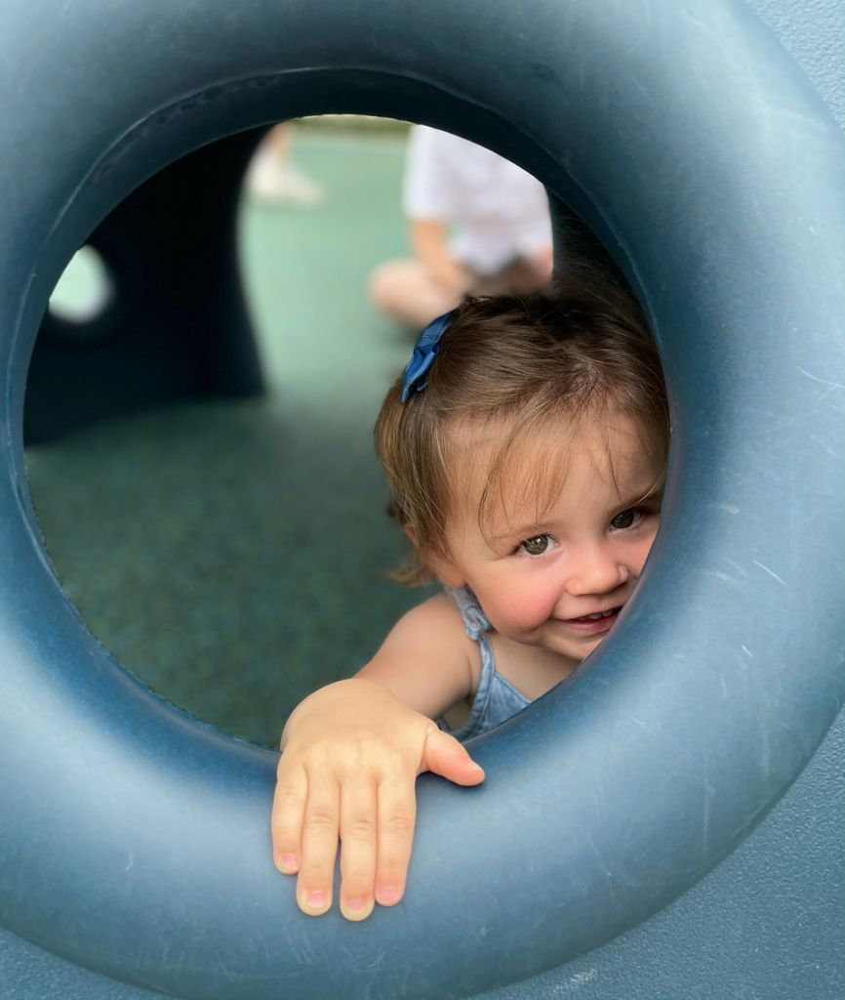

# Hi, I'm Kamil :wave:

First of all, I'm looking forward to getting to know you!

## Why a README? (It’s a bit weird, I get it)

1. The creation has helped me identify and refine my thoughts and values.
1. Hopefully this will help you understand me better and help us work together.

## Management Style

1. **Collaborative**  
    1. I like to discuss decisions early and iterate on their execution together. I
    generally will share ideas in a 1-1 setting before socializing it to a wider
    audience.
    1. It's important to me that we have a culture of speaking openly,
    helping each other out and respecting our differences in perspective. That said,
    we have to disagree and commit when we can't come to a consensus.
1. **Deep diver** 
    1. I'm not a micromanager but I like to dive deep into details and get my hands
    dirty. It’s how I will know how to help if you need me later.
1. **Bias for action**
    1. I expect us to move fast when it comes to making ["reversible" decisions](https://github.com/ksindi/managers-playbook#making-decisions)
    but to take time and document outcomes and define success for "irreversible" ones.
    1. I expect you are making decisions a lot without me and if you come to me I'll
    usually put it back on you with, "What do you want to do?" or "What should you
    do?" and help you decide.
1. **Accountable and organized**
    1. I take action items seriously and I expect you to know what yours are,
    when they are due, and get them done. I don't like chasing them but I do
    notice when things slip—it's fine to renegotiate deadlines but I'll be annoyed
    if it's the day after the deadline.
    1. I like to make agreements on "how we do things" that we then agree to
    make exceptions on as a group instead of everyone inventing their own process.
1. **Data informed**
    1. I like data and dashboards so there is an objective way to measure progress and
    results.
    1. If we're discussing something and you know of data that would
    be useful to our decision, bring it up.
1. **Transparency**
    1. Visibility and bias towards over-communicating is very important to me. I expect
    us to proactively communicate decisions and socialize ideas early.
    1. I'm a fan of "push" over "pull" when it comes to information sharing. I rather be
    proactively informed about changes or risks such as timeline than find out at the last minute.
1. **Celebrate wins** :tada:
    1. I love it when we celebrate wins as a team. We should also give as much
    credit as possible and recognize those outside of our organization for their inputs.
1. **Feedback**
    1. I need feedback. It helps me grow as a person. I rather receive it the same day that
    prompted it or in our next 1:1. I give feedback the same way.

## Communication

1. **1:1s**
    1. Bi-weekly or weekly 1:1s. I’m a big fan of a joint 1:1 doc to track our agendas,
    actions, goals, and updates. Feel free to write in it before the meeting to give a
    heads up on topics you want to discuss.
    1. We’ll do a career session at some point in our first few months of working
    together—your history, why you’ve made choices you have made, what your
    ambitions are for the future, etc. These help me know where you are in terms of
    personal development interests and ambitions with respect to longer-term
    plans.
    1. Personal goals—I believe in the two of us reviewing the top 3-5 personal goals
    you have each quarter or so (these are the things that you personally spend your
    time on, not your team plans, which I know you also spend time on). We can
    discuss them each quarter and then mark out a plan on how we make sure you
    get the time, space, and support to accomplish what you need. I do these every
    3–6 months and will share mine with everyone.
1. **Email / Documentation / Slides**
    1. I like email for disseminating decisions and required actions.
    1. We should document decisions, plans and proposals in an Amazon-style
    ["6 pagers" and "2 pagers"](https://medium.com/@inowland/using-6-page-and-2-page-documents-to-make-organizational-decisions-3216badde909)
    with an appendix of FAQs.
    1. I think slides are okay for information being disseminated. But they're
    suboptimal for information being pondered, discussed and agreed upon.
1. **Meetings**
    1. I prefer meetings after 11am local time. I like to use the morning for
    thinking and following up on outstanding items.
    1. Let's start with discussions over email and only have meetings when necessary.
    1. I'm in favor of "write optimized" meetings (e.g. brainstorming, active discussion)
    being fewer than 5 people and "read optimized" meetings (e.g.
    announcements, presentations) being as inclusive as possible.
    1. I will push back when recurring meetings have no standing agenda.
    1. After every meeting we should document action items with owners and timing over email
    or a shared document.
    1. I'm okay with people being late to meetings as long as they give a heads up in
    advance.
1. **Humor**
    1. I love puns no matter how cheesy! Bonus points for alliterations.
    1. I :heart: emojis.
    1. Let's have fun while we work hard.

## Strong Opinions, Weakly Held

1. I've [written](https://github.com/ksindi/managers-playbook) thoughts on engineering management I live by.
1. I love CI/CD because it [optimizes for
iteration speed](https://erikbern.com/2017/07/06/optimizing-for-iteration-speed.html), which is crucial in a startup environment.
1. I think [Amazon's Leadership Principles](https://www.amazon.jobs/en/principles) is the best document ever written on being a leader.
1. I like monorepos, but I don't like monoliths or shared libraries that couple systems and
development.
1. I'm a fan of [log-based architectures](https://www.slideshare.net/KamilSindi/polylog-a-logbased-architecture-for-distributed-systems) over traditional service oriented architectures. Happy to chat more about it!
1. I subscribe to the Toyota philosophy of quality assurance:
DevOps, security and QA are everyone's jobs and we need to continuously improve on it as a culture.

## Personal Notes

1. I've lived in 10 different cities. I spent my formative years in Switzerland.
2. I've studied 7 languages, but I can’t say I speak any of them particularly well.
3. In my spare time I like to rock climb and hike. Although these days I'm just changing dirty diapers :baby:.
4. I still like to [code](https://github.com/ksindi) and contribute to open source. I recently wrote a [CLI](https://github.com/ksindi/snoo)​ for my daughter’s SNOO smart bassinet.
5. I used to work in finance. I still enjoy following markets and learning about businesses.
6. I live with my wife Daniela and daughter Zofia in Connecticut. We have a pug named Peanut.  
    
    

## Credit

The idea of this README comes from [Claire Hughes Johnson](https://www.linkedin.com/in/claire-hughes-johnson-7058).
See [Working with Claire: an unauthorized guide](http://growth.eladgil.com/book/the-role-of-the-ceo/insights-working-with-claire/).
